# Gravity Engine

A 2D physics sandbox built with Rust, [macroquad](https://github.com/not-fl3/macroquad) and [rapier2d](https://rapier.rs/). Drop images, spawn shapes or fetch retro web buttons — everything becomes a rigid body you can throw, pull, spin and blow up.


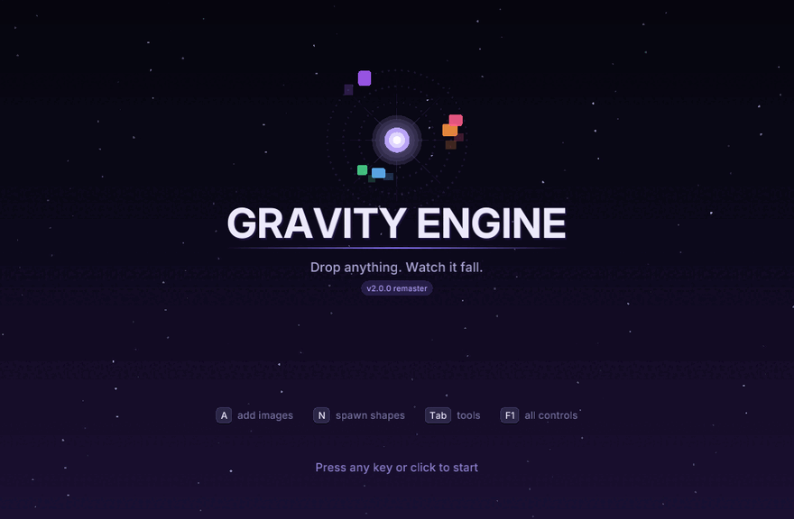

| Sandbox | Settings drawer (Space) | Tool picker (Tab) |
|---|---|---|
| 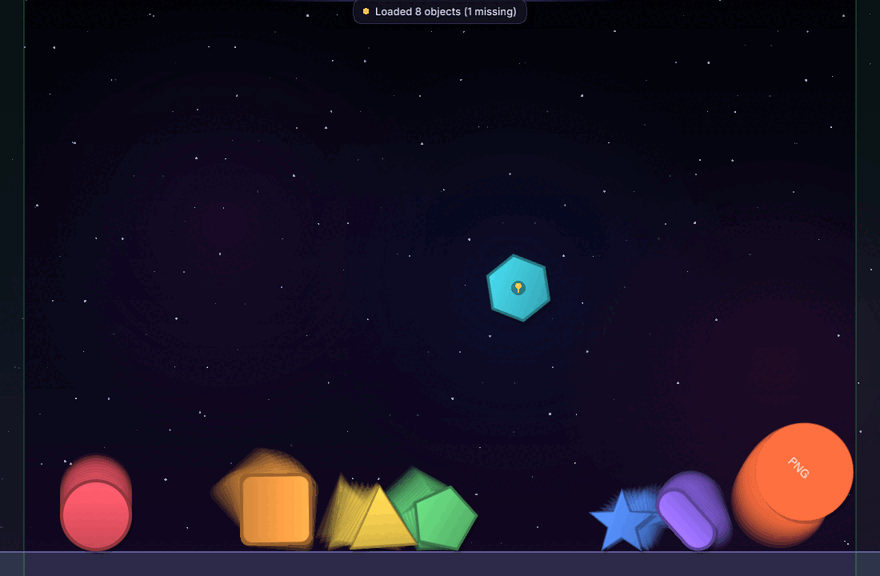 | 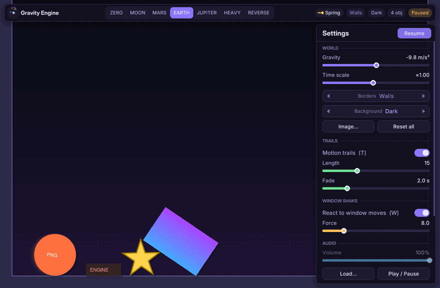 | 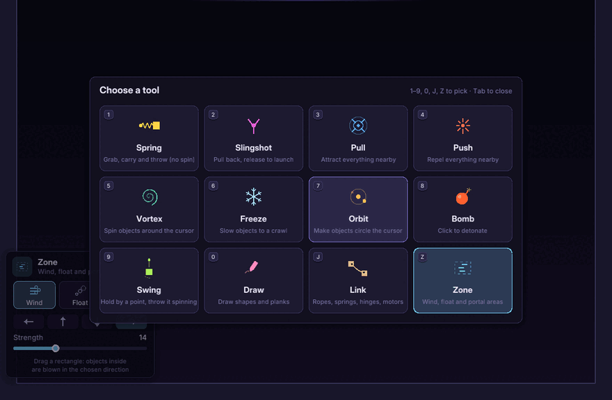 |

## What's new in 2.9

| Night: lamps cast shadows | Storm: lightning sets things on fire |
|---|---|
| 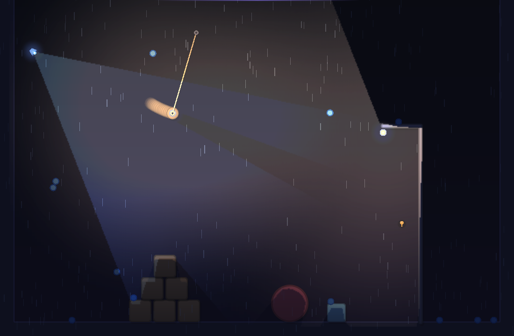 | 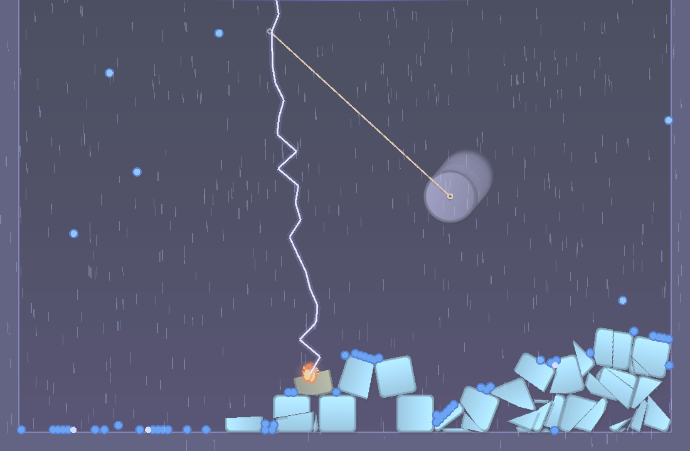 |

| Planets with their own gravity | Grappling hook |
|---|---|
| 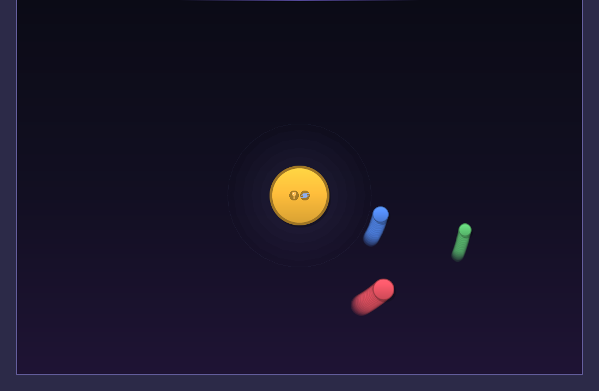 | 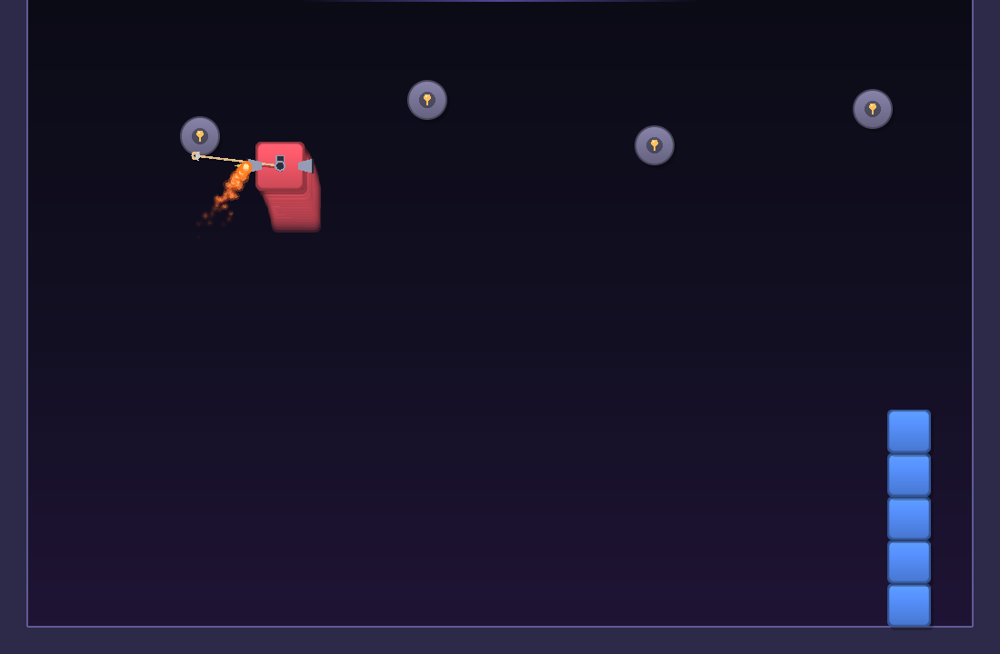 |

- **Planets** — any object can have its own gravity (right-click → *Make it a planet*, or the *Planet gravity* slider and preset in the properties panel): everything nearby falls towards it and can orbit it. Example scene *Solar system*.
- **Weather** (`Shift+H`, or *Weather* in the settings) — **rain** falls as real drops that fill containers and put out fires under the open sky, **snow** settles in drifts (and melts near fire; it is also a new kind of grain for the Pour tool), and a **storm** brings gusts of wind, heavy rain and **lightning** that strikes the highest thing around and sets it on fire, with thunder.
- **Night** (`Shift+T`, darkness in the settings) — the scene goes dark and only light shows it: **lamps** (a new gadget: a bulb all round or a spotlight, in six colours) cast real shadows, and fire, embers, lasers, thrusters, hot objects and lightning glow.
- **Grappling hook** (a new gadget) — put it on an object and hold its arrow key: the hook shoots at the pointer, catches what it hits and reels in; let go to let go. One set to *always* hangs on where it catches, and one fixed in the world is a winch that pulls things in. The knife cuts its rope. Example scene *Grapple swing*.
- Night and weather are saved in scene files; example scene *Night lights*.

## What's new in 2.8

| Lasers and mirrors | Rocket car (← → drive, ↑ thruster, ↓ cannon) |
|---|---|
| 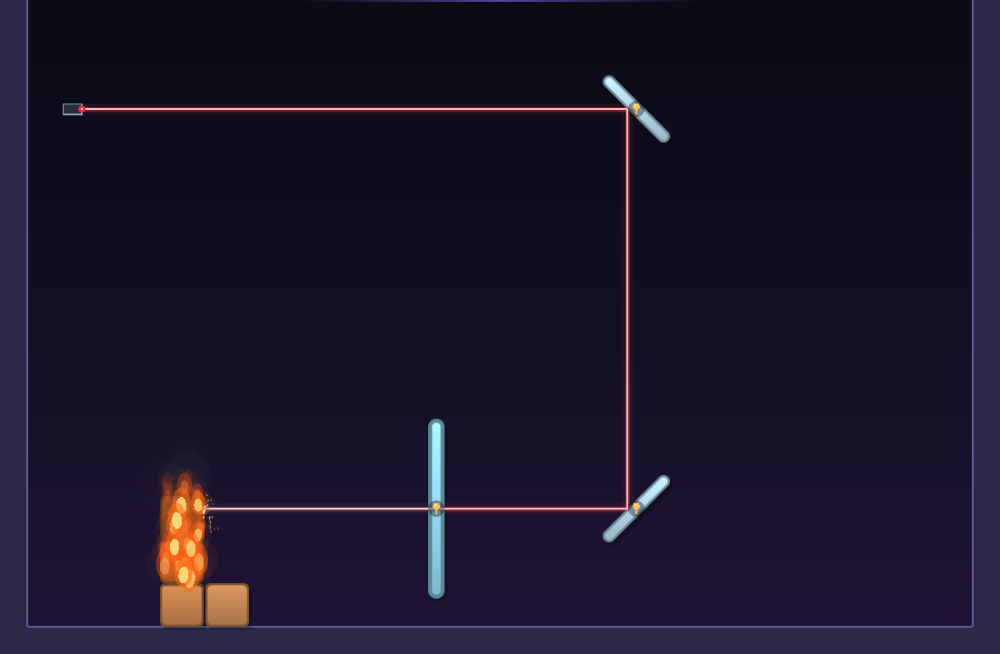 | 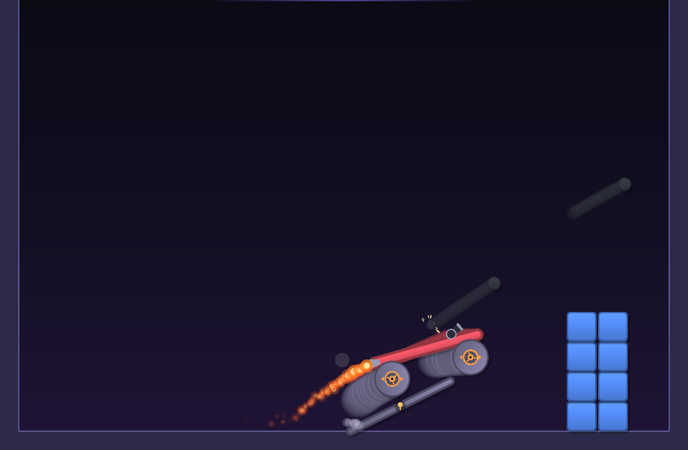 |

- **Gadget tool** (`L`) — attach a **laser**, **thruster** or **cannon** to any object (or fix it in the world), aimed by dragging. Each one works all the time, while an arrow key is held, or on the music's beat.
- **Lasers** — beams bounce off mirrors (a new *Mirror* property and preset), pass through glass and take its colour, and push and set fire to what they hit.
- **Thrusters** push their object with a jet of flame; fixed in the world they blow like a fan. **Cannons** fire balls, shapes, grains or copies of your last image, with recoil.
- **Driven motors** — a motor can be driven with `←` / `→` (Link tool → Motor → *Drive it with ← →*): build a car and drive it. Example scenes *Laser lab* and *Rocket car*.
- **Three laser challenges** — your lines are mirrors: bend the beam into the target.

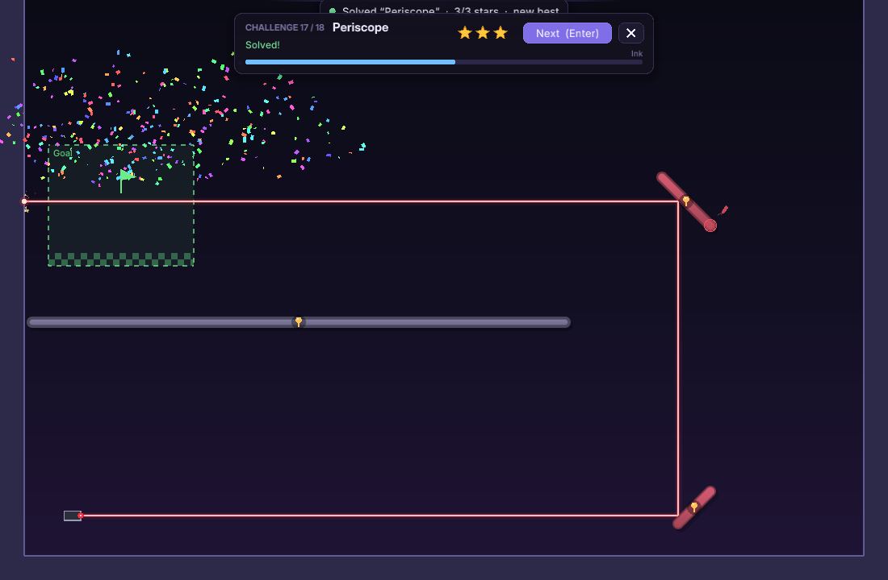

## What's new in 2.7

| Fire (Y) | Jelly and cloth (U, Shift+U) |
|---|---|
| 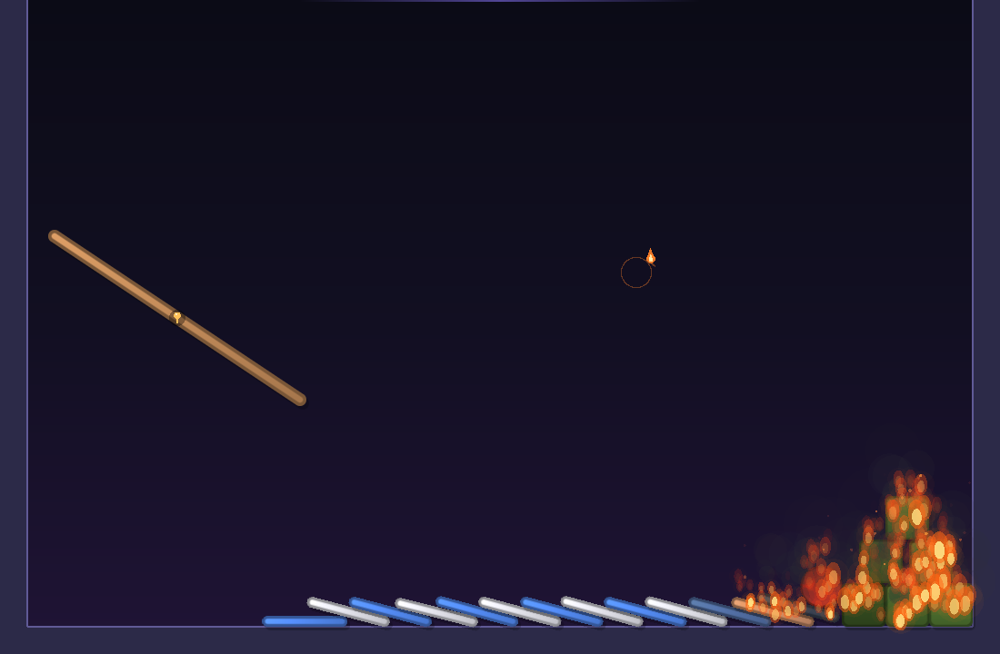 | 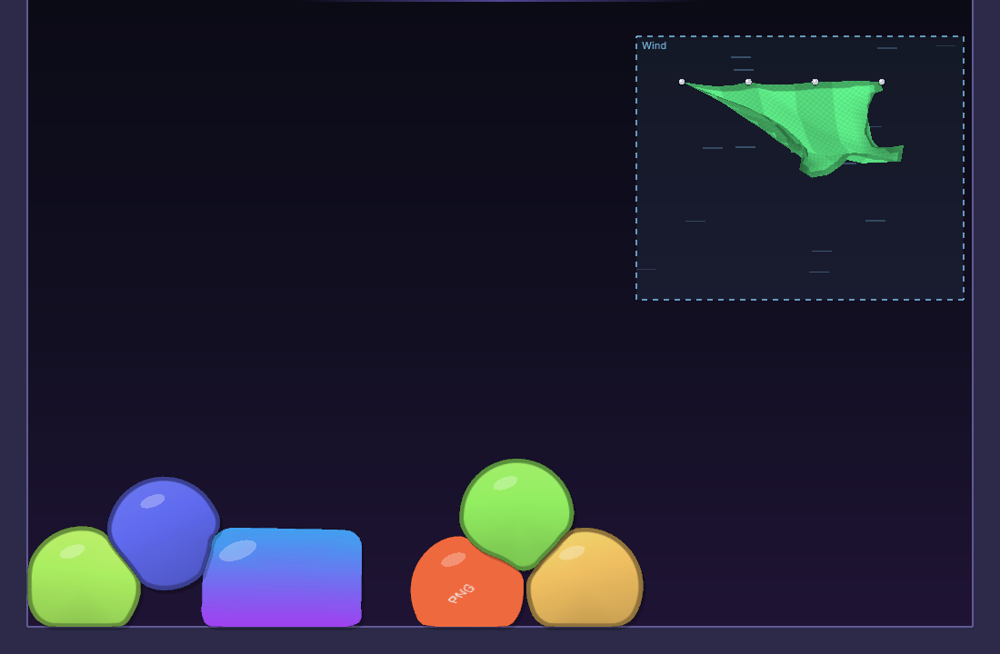 |

- **Fire** (`Y`) — set things alight: fire spreads to whatever touches it (faster upwards), burns ropes through and leaves ash. Ice melts into water, glass cracks, metal glows, and water or poured liquid puts it out. Explosions start fires too.
- **Jelly** (`U`) — squashy, wobbly blobs; press `U` over any image or shape to turn it into jelly.
- **Cloth** (`Shift+U`) — pinned fabric that drapes, flaps in wind zones, tears when pulled too hard, and can be cut with the knife or burnt. Right-click an image → *Hang it as a flag*.
- **Physical player** (`Shift+X`) — the Winamp player becomes a real object: it falls, tumbles, gets blown up and carries things, while all its buttons still work. Grab a title bar to throw it.

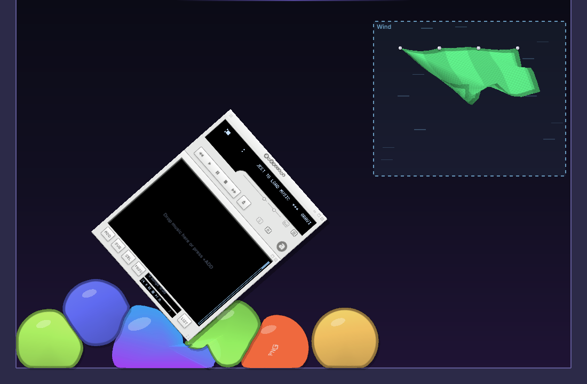

## What's new in 2.6

| Playlist and equalizer | Ragdolls and the knife |
|---|---|
| 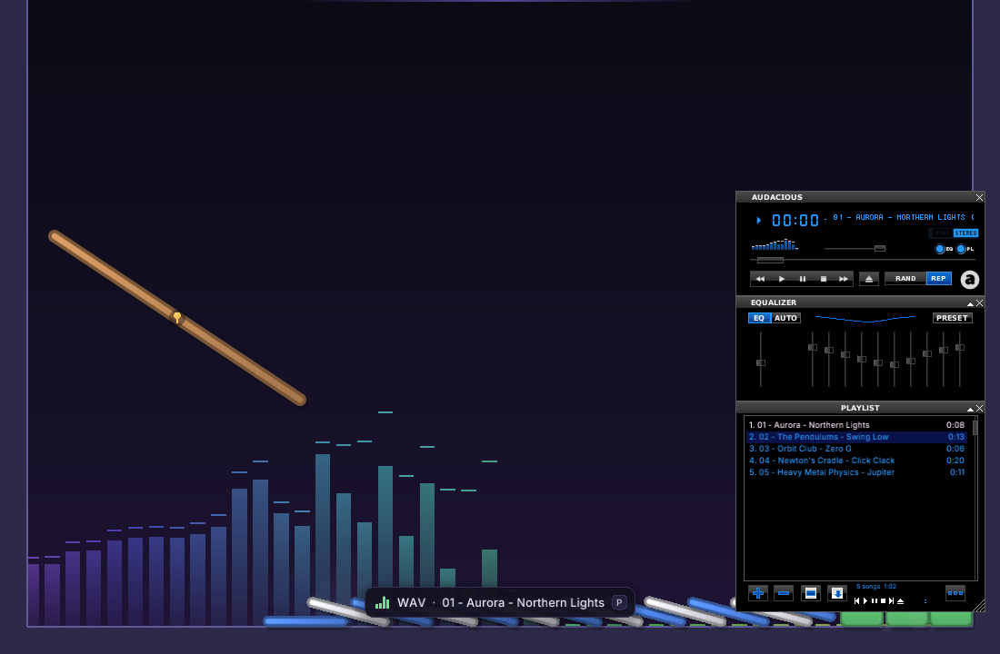 | 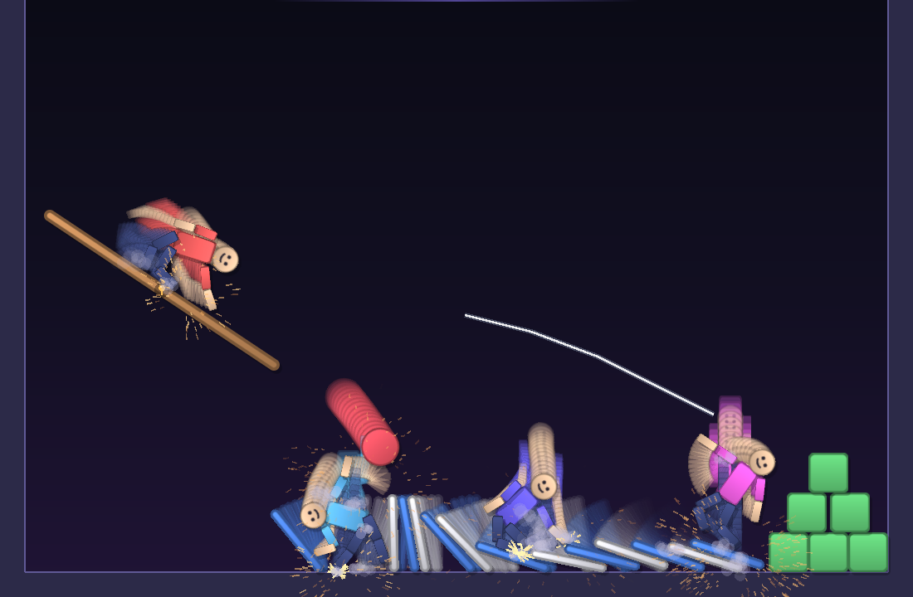 |

- **Playlist and equalizer** — the classic player gets Winamp's playlist window (reorder, remove, sort, shuffle, repeat; kept between sessions, `.m3u` too) and a working 10-band equalizer with presets, both skinned.
- **Rewind** — hold `←` to play the last 8 seconds backwards, then let go to change what happens.
- **Knife** (`C`) — cut ropes, springs and joints, and slice objects in two.
- **Ragdolls** (`O`) — floppy characters; press `O` over an image to make it the head.

## What's new in 2.5

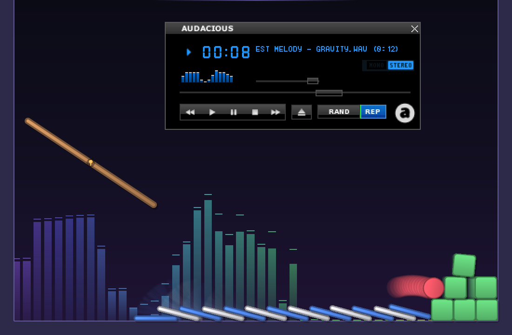

- **Classic player** (`X`) — a Winamp-style window for the music player: transport buttons, time, scrolling title, spectrum, volume and seek bars. Double-click its title bar for double size.
- **Winamp 2 / Audacious skins** — `.wsz` skins and Audacious skin folders (with their `skin.hints` layouts). Installed Audacious skins are found automatically; cycle them in *Settings → Audio → Skin*, or drop a `.wsz` on the window.

## What's new in 2.4

| Challenge editor (Shift+E) | Sand, liquid and beads (K) |
|---|---|
| 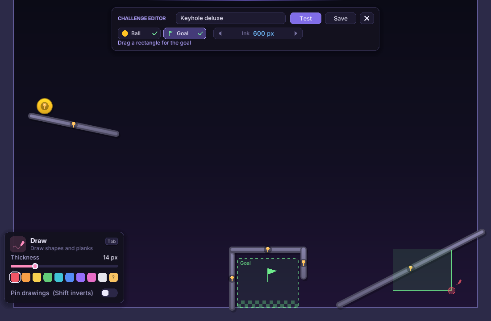 | 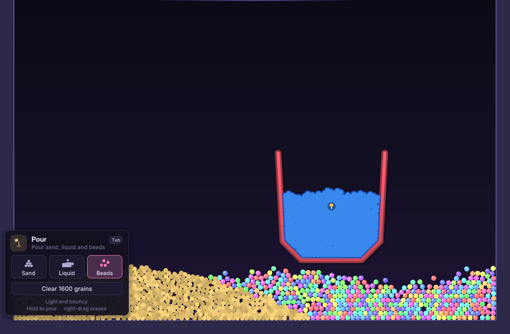 |

- **Challenge editor** — build your own levels: place the ball and the goal, set the ink, test it (you must solve it to save it), and share the `.gchallenge` file. Your levels live in Library → *My challenges*.
- **Ten new challenges** (fifteen in all) and **stars** — ★★★ when you use half the ink or less.
- **Sound effects** — synthesised hits (by size and material), breaking glass, explosions, pops and a win fanfare.
- **Slow motion** — time slows for a moment on shatters, explosions and very hard hits.
- **Camera** — `Ctrl`+wheel or `+` / `-` to zoom, middle-drag to pan, `Home` to fit; worlds up to 3× the window (*World size*).
- **Select tool** (`S`) — box-select, move, copy / paste, duplicate, pin, delete, and **glue** objects into rigid groups.
- **Pour tool** (`K`) — sand that piles up, a liquid that flows, bouncy beads.

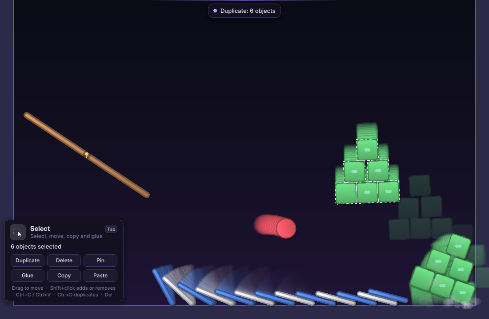

## What's new in 2.3

| Challenges (E) | Breakable objects |
|---|---|
| 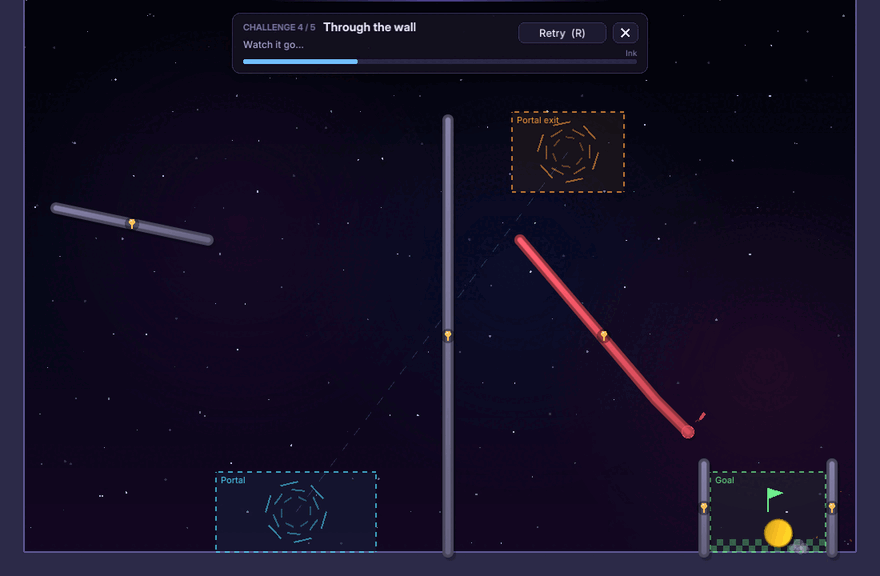 | 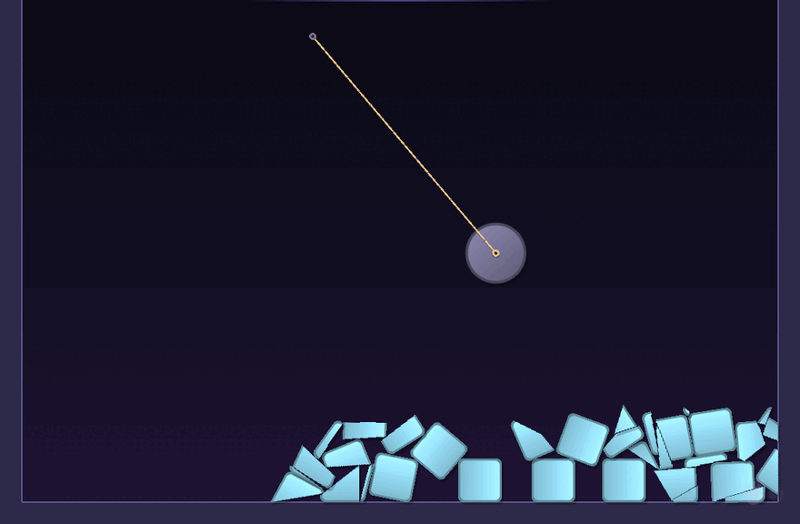 |

- **Challenges** — five puzzles: draw lines (with limited ink) so the golden ball reaches the goal. `Space` to release it, `R` to retry.
- **Example scenes** — Newton's cradle, domino run, a car, a wrecking ball, a pool party, magnets, a conveyor factory and a portal loop, all in the library (`E`).
- **Breakable objects** — objects marked *Breakable* (or *Glass*) shatter into real pieces on hard impacts.
- **Particle effects** — sparks, dust, splashes, debris and confetti.
- **Motors** — spinning hinges for wheels, mills and cars (Link tool → Motor).
- **Zone tool** (`Z`) — wind, float and portal areas.
- **Magnets and conveyor surfaces** in the Properties panel.

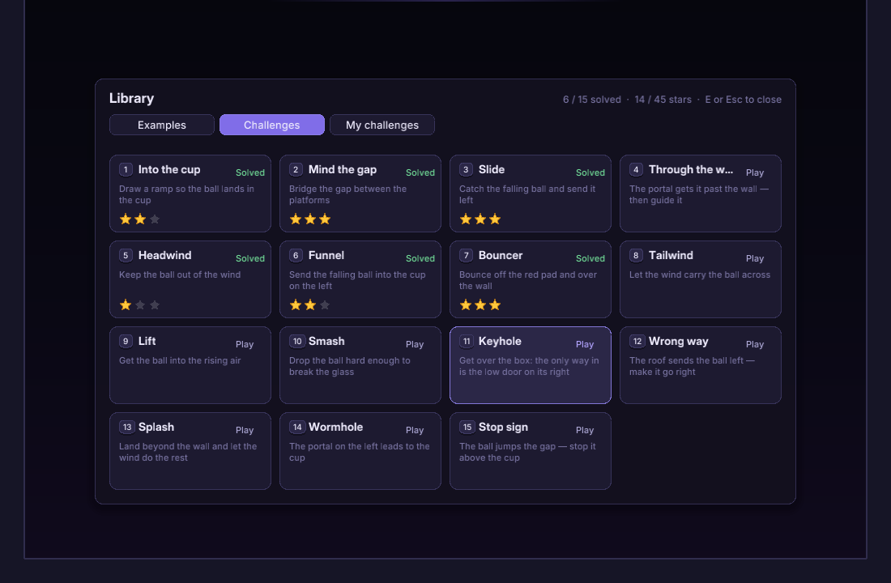

## What's new in 2.2

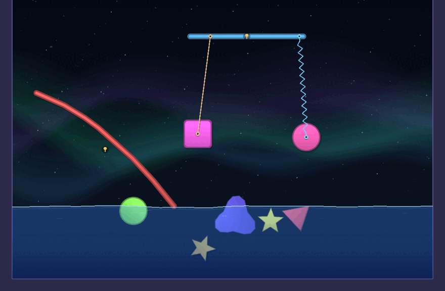

- **Draw tool** (`0`) — draw with the mouse: a loop becomes a filled shape, a line becomes a plank. Pin drawings to build ramps and courses.
- **Link tool** (`J`) — ropes, springs and hinges between objects, or to the background.
- **Undo / redo** (`Ctrl+Z` / `Ctrl+Y`) for every edit.
- **Object properties** (right-click → *Properties…*, or `I`) — bounce, friction, mass and gravity, with presets (Rubber, Ice, Heavy, Balloon).
- **Water** (`H`) — buoyancy and drag; light objects float, heavy ones sink, and the waves follow the music.
- **GIF recording** (`F11`) — record the scene without the interface.
- **Windows build** on the releases page.

## What's new in 2.0 (remaster)

- **New UI** — floating HUD, a settings drawer that slides in when paused, a tool picker with animated icons, toasts, a “now playing” pill, redesigned menus, help and title screen, bundled [Inter](https://rsms.me/inter/) font.
- **Scenes** — save and reopen whole scenes (`Ctrl+S` / `Ctrl+O`, `.gscene`); images are embedded so scenes can be shared.
- **Persistent settings** — gravity, tool, trails, volume, background… are restored on the next launch.
- **Drag & drop** files onto the window (images, audio, playlists, scenes).
- **Screenshots** (`F12`), **slow motion** (`[` / `]`) and **frame-by-frame stepping** (`.` while paused).
- **Pin objects** in place (right-click → *Pin*); pinned objects can still be dragged around with *Spring*.
- **Swing tool** (`9`) — hold objects by the point you click; they dangle and spin when thrown.
- **Better physics** — frame-rate independent simulation (it used to run faster on high-refresh screens), mass-aware tools, exact colliders for spawned shapes (balls, capsules, rounded boxes, concave stars), a ceiling so *Reverse* gravity no longer loses your objects.
- **New content** — Hexagon and Capsule shapes, random-colour spawning, hold-to-spawn, *Aurora* background, smooth gradient backgrounds.
- **Fixes** — duplicate/resize now work for fetched buttons and spawned shapes, correct animated-GIF disposal, window tracking no longer stalls frames, web fetches run in parallel.

## Features

- **Drop any image** — PNG, JPG, GIF (animated), WebP, BMP, SVG, TIFF, ICO, TGA, QOI…; transparency is used to compute convex-hull colliders
- **Shape spawner** (`N`) — Circle, Box, Triangle, Pentagon, Hexagon, Star, Capsule; pick a colour (or random) and size, click or hold to spawn
- **88×31 button fetcher** (`F`) — 20 random classic web buttons scraped from 8 galleries (animated GIFs supported)
- **Game logo fetcher** (`L`) — 20 random logos from [SteamGridDB](https://www.steamgriddb.com/) (needs an API key, see below)
- **17 tools** — `Tab`, `1`–`9`, `0`, `J`, `Z`, `S`, `K`, `C`, `Y` or `L`:

  | # | Tool | Description |
  |---|------|-------------|
  | 1 | Spring | Grab, carry and throw (no spin) |
  | 2 | Slingshot | Pull back, release to launch |
  | 3 | Pull | Attract everything nearby |
  | 4 | Push | Repel everything nearby |
  | 5 | Vortex | Spin objects around the cursor |
  | 6 | Freeze | Slow objects to a crawl |
  | 7 | Orbit | Make objects circle the cursor |
  | 8 | Bomb | Click to detonate |
  | 9 | Swing | Hold by the clicked point: objects dangle and spin when thrown |
  | 0 | Draw | Draw shapes and planks (`Shift` pins / unpins them) |
  | J | Link | Ropes, springs, hinges, motors and glue between objects, or to the background |
  | Z | Zone | Wind, float and portal areas |
  | S | Select | Select objects (click, `Shift`+click, box), move them, copy / paste, duplicate, pin, delete, glue |
  | K | Pour | Pour sand, liquid or beads; right-drag erases |
  | C | Knife | Cut ropes, springs, joints and cloth; slice objects in two |
  | Y | Fire | Set things on fire, melt ice |
  | L | Gadgets | Lasers, thrusters (or fans), cannons, lamps and grappling hooks, always on, on an arrow key or on the beat |

  The tool card (bottom left) holds each tool's settings: radius / strength for area tools (mouse wheel: radius, `Shift`+wheel: strength), thickness, colour and pinning for Draw, the kind of link (and motor speed) for Link, the kind of zone for Zone, the selection commands for Select and the kind of grain for Pour.
- **7 border modes** — `B` to cycle (`Shift+B` backwards):

  | Mode | Description |
  |------|-------------|
  | Walls | Solid walls all around |
  | Loop | Objects wrap left ↔ right |
  | Kill | Objects leaving the sides are deleted |
  | Warp | Objects wrap on all four sides |
  | Bounce | Springy trampolines on the sides |
  | Repulse | Soft force field on every edge |
  | Portal | No floor — every edge is a portal, animated rainbow borders |
- **7 backgrounds** — `G` to cycle: Dark, Space, Grid, Sunset, Ocean, Aurora, Custom (`Shift+G` picks an image)
- **Water** (`H`) — a pool with buoyancy and drag; level and density in the settings drawer, waves react to splashes and to the music
- **Object properties** — bounce, friction, mass, gravity, planet gravity, breakable, flammable, mirror, magnet and conveyor per object (right-click → *Properties…*, or `I`)
- **Library** (`E`) — example scenes, eighteen challenges (three with a laser) with star ratings, and your own challenges
- **Challenge editor** (`Shift+E`) — make levels and share them as `.gchallenge` files
- **Camera** — zoom (`Ctrl`+wheel, `+` / `-`, `Home` to fit) and pan (middle mouse button); *World size* makes the arena up to 3× the window
- **Sound effects and slow motion** — procedural sounds for hits, glass, explosions and wins; a moment of slow motion on big impacts (both can be turned off)
- **Undo / redo** — `Ctrl+Z` / `Ctrl+Y` for every edit
- **Gravity** — presets ZERO / MOON / MARS / EARTH / JUPITER / HEAVY / REVERSE in the HUD, or any value with the slider
- **Window shake** (`W`) — moving the window pushes every body; KDE Wayland via KWin DBus, X11 otherwise
- **Trails** (`T`) — motion-blur ghost trail with length and fade settings
- **Audio visualizer** — `V` cycles a spectrum layer behind the objects (Bars / Wave / Radial); `Shift+V` drops a visualizer *screen* that is a real physics object (throw it, pin it, resize it). Sensitivity and an optional "objects jump on the beat" mode live in the settings drawer
- **Audio player** (`M`) — tracker modules (.mod/.xm/.it/.s3m/…), common formats (.mp3/.flac/.wav/.ogg/…), `.pls` playlists including HTTP radio streams
- **Classic player** (`X`) — Winamp-style window with play / pause / stop / next / previous / seek / volume, a playlist window (shuffle, repeat, reorder, `.m3u` / `.pls`) and a 10-band equalizer, skinned with Winamp 2 `.wsz` or Audacious skins (found automatically in Audacious's skin folders, `~/.config/gravity_engine/skins/`, or dropped on the window). `Shift+X` turns it into a physical object you can throw around
- **Rewind** (hold `←`) — play the last 8 seconds backwards
- **Ragdolls** (`O`) — floppy characters with limited joints (over an image: it becomes the head)
- **Fire and heat** (`Y`) — burning, spreading fire, ash, melting ice, cracking glass; water puts it out
- **Jelly and cloth** (`U` / `Shift+U`) — soft bodies from any image or shape, and fabric that drapes, flaps in the wind and tears
- **Gadgets** (`L`) — lasers that reflect off mirrors and cross glass, thrusters, fans, cannons, lamps and grappling hooks; motors driven with the arrow keys
- **Planets** — objects with their own gravity that others orbit
- **Weather and night** (`Shift+H` / `Shift+T`) — rain, snow and storms with lightning; a night lit by lamps with shadows, fire and lasers
- **Screenshots** (`F12`) and **GIF recording** (`F11`, up to 30 s) of the scene, without the interface
- **Debug overlay** (`D`) — FPS, collider outlines, velocities and details of the object under the cursor

## Controls

Press **F1** in the app for the full list.

| Key / Input | Action |
|-------------|--------|
| Left-drag | Use the current tool |
| Right-click | Object menu (Resize, Duplicate, Resize all, Properties, Pin, Make it a planet, Make it jelly, Hang it as a flag, Detach links, Delete) |
| `Tab` / `1`–`9`, `0`, `J`, `Z`, `S`, `K`, `C`, `Y`, `L` | Tool picker / select a tool |
| `←` (hold) | Rewind time (`Shift+←` when `←` drives something) |
| `←` `↑` `→` `↓` | Drive motors, work the gadgets set to an arrow (a grappling hook shoots at the pointer) |
| `O` | Drop a ragdoll (over an image: it becomes the head) |
| `U` / `Shift+U` | Jelly / cloth (over an object: it turns to jelly / is hung as a flag) |
| `E` / `Shift+E` | Examples & challenges / challenge editor |
| `Ctrl`+Wheel, `+` / `-`, `Home` | Zoom at the pointer, zoom in / out, fit the world |
| Middle-drag | Pan the view |
| `Ctrl+C` / `Ctrl+V` / `Ctrl+D` / `Ctrl+A` / `Ctrl+G` | Copy / paste / duplicate / select all / glue (Select tool) |
| `Space` / `R` / `Enter` (in a challenge) | Release the ball / retry / next challenge |
| Wheel / `Shift`+Wheel | Tool radius / strength (Draw: thickness; spawn size when the spawner is open) |
| `I` | Properties of the object under the cursor |
| `Ctrl+Z` / `Ctrl+Y` | Undo / redo |
| `A` | Add images |
| `N` | Shape spawner |
| `F` / `Shift+F` | Fetch 88×31 buttons / game logos |
| `Del` | Delete the object under the cursor |
| `R` | Clear all objects |
| `Space` | Pause and open the settings drawer |
| `.` | Step one frame (while paused) |
| `[` / `]` | Slower / faster time |
| `B` / `G` | Next border mode / background |
| `Shift+G` | Background from an image |
| `W` / `T` / `H` | Toggle window shake / trails / water |
| `Shift+H` / `Shift+T` | Next weather (clear, rain, snow, storm) / night |
| `M` / `P` | Load music / play-pause |
| `X` / `Shift+X` | Classic player (Winamp / Audacious skins) / make it a physical object |
| `V` / `Shift+V` | Visualizer behind objects / spawn a visualizer screen |
| `Ctrl+S` / `Ctrl+O` | Save a scene / open a scene or a challenge |
| `F12` / `F11` | Screenshot / start or stop a GIF recording (scene only, without UI) |
| `D` | Debug overlay |
| `F1` | Help |
| `Esc` | Close the top-most panel, or quit |
| `Q` | Quit |

## Download

Linux and Windows builds are attached to each [release](https://github.com/elimanee/gravity-engine/releases). On Windows, unzip `gravity_engine-windows-x86_64.zip` and run `gravity_engine.exe` (keep the DLLs next to it).

## Build & Run

Requires Rust (stable) plus a few system libraries. On Debian / Ubuntu:

```bash
sudo apt install pkg-config libopenmpt-dev libasound2-dev libx11-dev libxi-dev \
                 libgl1-mesa-dev libwayland-dev libxkbcommon-dev libgtk-3-dev libdbus-1-dev
cargo run --release
```

Command line: `gravity_engine [--no-title] [FILES…]` — files can be images, audio, playlists, `.gscene` scenes, `.gchallenge` challenges or `.wsz` skins.

`gravity_engine --verify-challenges` plays every built-in challenge with its reference solution (and once without drawing) and reports whether each one is solvable within its ink — handy when designing levels.

On Windows, install libopenmpt with [vcpkg](https://vcpkg.io) (`vcpkg install libopenmpt:x64-windows`), copy its `libopenmpt.lib` to a folder as `openmpt.lib`, set `OPENMPT_LIB_DIR` to that folder and run `cargo build --release`; the DLLs from vcpkg's `installed\x64-windows\bin` must sit next to the executable (or be on `PATH`). `.github/scripts/openmpt-windows.ps1` does all of this in CI.

For the fastest (but non-portable) binary, build for your own CPU:

```bash
RUSTFLAGS="-C target-cpu=native" cargo build --release
```

## Files & configuration

Everything lives in `~/.config/gravity_engine/` (or `$XDG_CONFIG_HOME/gravity_engine/`, or `%APPDATA%\gravity_engine\` on Windows):

| File | Purpose |
|------|---------|
| `settings.json` | Your preferences, saved on exit. Set `"show_title": false` to skip the title screen. |
| `scenes/` | Default folder for saved scenes |
| `challenges/` | Challenges made in the editor (`.gchallenge`), listed in Library → *My challenges* |
| `skins/` | Extra Winamp / Audacious skins (`.wsz` files or folders) for the classic player |
| `sgdb_key` | SteamGridDB API key for the logo fetcher (or set `SGDB_API_KEY`) |

Screenshots and GIFs go to `~/Pictures/gravity_engine/` (or `~/.config/gravity_engine/screenshots/` if you have no Pictures folder).

## Project layout

```
src/
├── main.rs            entry point, window config, CLI
├── app/               app state and frame loop (input → UI → actions → simulation → render),
│                      building tools, selection, impacts and shattering, fire, jelly and
│                      cloth, gadgets, grappling hooks, weather, night lights, the physical
│                      player, sounds and slow motion, challenge mode, challenge editor and verifier
├── camera.rs          zoom / pan and the world ↔ screen mapping
├── config.rs          constants and paths          settings.rs   persisted preferences
├── skin.rs            Winamp 2 / Audacious skins (.wsz, folders, skin.hints)
├── assets.rs          image / GIF / SVG decoding   shapes.rs     procedural shapes
├── scene.rs           .gscene save / load          background.rs animated backgrounds
├── drawing.rs         Draw-tool strokes → shapes   history.rs    undo / redo
├── recorder.rs        GIF recording                net.rs        web fetchers
├── effects.rs         particles                    library/      example scenes and challenges
├── weather.rs         rain, snow and lightning     lighting.rs   the night's light map and shadows
├── window_tracker.rs  window shake
├── audio/             tracker modules, streams, playlists, the visualizer's analyzer, sound effects
├── physics/           world, objects, tools, links, zones, water, grains, soft bodies, gadgets, magnets,
│                      planets, fracture, border modes
└── ui/                theme, widgets, HUD, drawer, tool card, menus, properties panel, overlays, title screen
```

`cargo test` runs the unit tests (decoding, shapes, drawings, links, glue, motors, conveyors, magnets, zones, water, grains, snow, jelly, cloth, laser beams, gadgets, planets, rope reeling, weather, night light, fracture, particles, sound synthesis, camera, scenes, challenge files, the built-in library, undo, GIF encoding, settings, playlist parsing, scraping…).

`gravity_engine --verify-challenges` (needs a display) checks that every built-in challenge can be solved.

## Usage of AI
this project is mainly developed by ai (totally not with claude )BUT the project will be rewritten at some point in future (if i don't get too lazy)
(might not be GDPR friendly)

## Stack

- [`macroquad`](https://github.com/not-fl3/macroquad) — windowing, rendering, input
- [`rapier2d`](https://rapier.rs/) — 2D rigid body physics
- [`rodio`](https://github.com/RustAudio/rodio) + [`symphonia`](https://github.com/pdeljanov/Symphonia) — audio decoding
- [`openmpt`](https://lib.openmpt.org/) + [`cpal`](https://github.com/RustAudio/cpal) — tracker module playback
- [`resvg`](https://github.com/RazrFalcon/resvg) — SVG rasterization
- [`rfd`](https://github.com/PolyMeilex/rfd) — native file dialogs
- [`image`](https://github.com/image-rs/image) / [`gif`](https://github.com/image-rs/image-gif) — image loading and processing
- [`ureq`](https://github.com/algesten/ureq) — HTTP for the web fetchers and audio streams
- [`serde`](https://serde.rs/) — settings and scene files
- [`x11`](https://github.com/erlepereira/x11-rs) / [`zbus`](https://github.com/dbus2/zbus) / [`windows-sys`](https://github.com/microsoft/windows-rs) — window position tracking (X11 / KDE Wayland / Windows)

The bundled Inter font is © The Inter Project Authors, licensed under the SIL Open Font License 1.1 (`assets/fonts/OFL.txt`).
